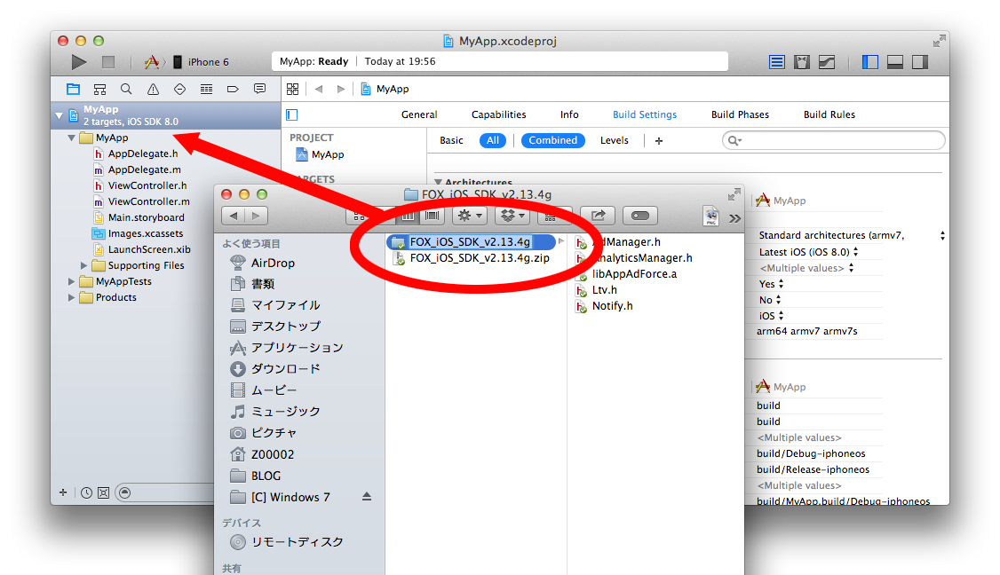

# Force Operation X란?

Force Operation X (이하 F.O.X)는, 스마트폰의 광고 효과 최적화를 위한 토탈 솔루션 플랫폼 입니다. 앱의 다운로드, 웹상에서의 사용자 액션의 측정은 물론, 스마트폰 사용자의 행동 특성에 근거한 독자적인 효과측정기준을 바탕으로 기업의 프로모션의 비용효과를 극대화 할 수 있습니다.

본 문서에서는 스마트폰 앱의 광고 효과 극대화를 위한 F.O.X SDK 설치 방법에 대해 설명합니다.

## F.O.X SDK 란?

F.O.X SDK를 앱에 설치함으로써 아래와 같은 기능을 제공합니다.

* **설치 측정**

광고 유입별 설치 횟수를 측정 할 수 있습니다.

* **LTV 측정**

유입원 광고별로 Life Time Value를 측정합니다. 주요 성과 지점으로는 회원 가입, 튜토리얼 돌파, 결제 등이 있습니다. 각 광고별 등록율, 과금율, 과금액 등을 측정 할 수 있습니다.

* **액세스 분석**

자연 유입과 광고 유입의 설치 비교, 앱의 기동수, 유니크 사용자수(DAU/MAU), 잔존율 등을 측정 할 수 있습니다.

# 1.	개요

본 문서에는, Force Operation X SDK Cocos2d-js 플러그인의 설치 방법에 대하여 설명하고 있습니다. Force Operation X SDK Cocos2d-js 플러그인은 iOS 및 Android에 대응하고 있습니다.

Force Operation X SDK 에서는, 설치 및 LTV의 측정, 액세스 분석이 가능합니다.

SDK의 설치가 완료된 후에는, 앱의 동작 및 성과 측정의 결과에 문제가 없는지 확인한 후에 마켓에 심사를 요청해 주십시오. 성과 측정의 테스트 방법에 대해서는, Force Operation X 관리자가 연락합니다.

## 1.1	SDK 사양

FOX SDK를 앱에 적용함으로써 아래의 기능을 제공합니다.

|처리|필수|개요|
|:------:|:------:|:------|
|설치 측정|필수|기동 시는 웹 브라우저가 기동하여, Cookie 측정으로 광고 효과를 측정합니다. 컨버전수, CVR등을 측정할 수 있습니다. 메소드명：sendConversion|
|LTV 측정|옵션|임의의 성과 지점에서 성과를 통지하고, 광고 별로 과금 수나 가입 수를 측정합니다. 과금 금액, 탈퇴 수 등을 측정 할 수 있습니다. 메소드명：sendLtv|
|액세스 분석|옵션|앱 기동 및 백그라운드로 부터의 복귀의 기동 측정을 합니다. 기동수, 액티브 유저수(DAU), 잔존율등의 측정이 가능합니다. 매소드명：sendStartSession|

> Force Operation X SDK Cocos2d-js 플러그인은 네이티브 버전 SDK에 브리치를 행하는 래퍼(Wrapper)로서 구현하고 있습니다. SDK 도입에는 플러그인과, iOS 및 Android의 네이티브 버전 SDK가 필요합니다.

#2.	iOS용 Xcode 프로젝트 설정

##2.1	SDK의 압축 해제

다운로드 한 SDK 「FOX_Cocos2djs_SDK_<버전>.zip」의 압축을 해제합니다. Classes 폴더에 존재하는 파일은 아래와 같습니다.

파일명|필수|개요
:--------|:-------------:|:--------:
jsb_Cocos2dxFox_auto.cpp|필수|JavaScript에서 C++를 사용하기 위한 jsb파일
jsb_Cocos2dxFox_auto.hpp|필수|JavaScript에서 C++를 사용하기 위한 jsb파일
Cocos2dxFox.h|필수|헤더 파일. Cocos2d-x에서 SDK를 사용하기 위한 래퍼
Cocos2dxFox.mm|	iOS 전용	|라이브러리 파일. Cocos2d-x에서 FOX SDK를 사용하기 위한 iOS용 래퍼
Cocos2dxFox.cpp|Android 전용|라이브러리 파일. Cocos2d-x에서 FOX SDK를 사용하기 위한 Android용의 래퍼
FoxVersionPlugin.h|옵션|헤더 파일. Cocos2d-x에서 번들 버전을 제어하는 래퍼
FoxVersionDelegate.m|옵션|라이브러리 파일. Cocos2d-x에서 번들 버전을 제어하는 래퍼
FoxVersionPlugin.h|옵션|헤더 파일. Cocos2d-x에서 번들 버전을 제어하는 래퍼
FoxVersionPlugin.m|옵션|라이브러리 파일. Cocos2d-x에서 번들 버전을 제어하는 래퍼
FoxReengagePlugin.h|옵션|헤더 파일. Cocos2d-x에서 URL 스키마 경유의 기동 측정을 위한 래퍼
FoxReengagePlugin.m|옵션|라이브러리 파일. Cocos2d-x에서 URL 스키마 경유의 기동 측정을 위한 래퍼

위의 파일은 래퍼임으로 네이티브 SDK와 함께 사용할 수 있습니다.

아래 파일들이 iOS의 네이티브 SDK로 「FOX_iOS_SDK_<버전>」 폴더에 포함되어 있습니다.

파일명|필수|개요
:--------|:-------------:|:--------:
AdManager.h|필수|헤더 파일. 광고 효과를 측정함.
libAppAdForce.a|필수|라이브러리 파일. 광고 효과를 측정함.
Ltv.h|옵션|헤더 파일. LTV를 측정함.
AnalyticsManager.h|옵션|헤더 파일. 액세스를 분석함.

※「FOX_Cocos2djs_SDK_<버전>.zip」에 「FOX_iOS_SDK_<버전>」 폴더가 포함되어 있지 않은 경우에는

SDK 다운로드 사이트로부터 FOX_iOS_SDK_<버전>.zip을 다운로드한 후 사용하여 주십시오.

##2.2	라이브러리 추가
* Xcode 메뉴 「File」 → 「Add Files to "XXX"」를​​ 선택
* Cocos2dxFox.h, Cocos2dxFox.mm을 추가해 주십시오. Cocos2dxFox.cpp는 Android용 라이브러리이기 때문에 추가할 필요가 없습니다.
* 번들 버전 판정 기능을 사용할 경우 FoxVersionDelegate.h, FoxVersionDelegate.mm과 FoxVersionPlugin.h, FoxVersionPlugin.mm 총 4개 파일을 추가해 주십시오.
* 재반응 유도(Re-engagement)측정을 할 경우 FoxReengagePlugin.h과 FoxReengagePlugin.m 2개의 파일을 추가해 주십시오.
* 「Copy items into destination group’s folder」에 체크

[라이브러리를 추가를 위한 자세한 설명](./doc/integration/ko/README.md)

##2.3 Cocos2d-js 프로젝트의 Classes에 추가
* jsb_Cocos2dxFox_auto.cpp과 jsb_Cocos2dxFox_auto.hpp를 프로젝트의 Classes에 복사 
  (Android 프로젝트와 공통)

##2.4 프레임워크 추가

다음 프레임 워크를 프로젝트에 링크해 주십시오.

<table>
<tr><th>프레임워크 명</th><th>Status</th></tr>
<tr><td>AdSupport.framework</td><td>Optional</td></tr>
<tr><td>iAd.framework </td><td>Required</td></tr>
<tr><td>Security.framework </td><td>Required </td></tr>
<tr><td>StoreKit.framework </td><td>Required </td></tr>
<tr><td>SystemConfiguration.framework </td><td>Required </td></tr>
</table>

> AdSupport.framework은 iOS 6 이후에 추가된 프레임워크이기 때문에, 앱을 iOS 5 이전 버전에서도 동작시킬(iOS Deployment Target을 5.1 이하로 설정하는) 경우에는 weak link로 설정하기 위해 "Optional"로 설정하십시오.

[프레임워크의 설정 위한 자세한 설명](./doc/config_framework/ko/README.md)

##2.5 SDK 설정

SDK의 동작에 필요한 설정을 plist에 추가합니다. 「AppAdForce.plist」 파일을 프로젝트의 원하는 위치에 생성하고 다음의 키와 값을 입력하십시오.

<table>
<tr>
  <th>Key</th>
  <th>Type</th>
  <th>Value</th>
</tr>
<tr>
  <td>APP_ID</td>
  <td>String</td>
  <td>Force Operation X 관리자로부터 받은 SDK 도입 안내 메일의 값을 입력해 주십시오.</td>
</tr>
<tr>
  <td>SERVER_URL</td>
  <td>String</td>
  <td>Force Operation X 관리자로부터 받은 SDK 도입 안내 메일의 값을 입력해 주십시오.</td>
</tr>
<tr>
  <td>APP_SALT</td>
  <td>String</td>
  <td>Force Operation X 관리자로부터 받은 SDK 도입 안내 메일의 값을 입력해 주십시오.</td>
</tr>
<tr>
  <td>APP_OPTIONS</td>
  <td>String</td>
  <td>아무것도 입력하지 않습니다.(공백 상태)</td>
</tr>
<tr>
  <td>CONVERSION_MODE</td>
  <td>String</td>
  <td>1</td>
</tr>
<tr>
  <td>ANALYTICS_APP_KEY</td>
  <td>String</td>
  <td>Force Operation X 관리자로부터 받은 SDK 도입 안내 메일의 값을 입력해 주십시오. 액세스 분석을 이용하지 않는 경우는 설정할 필요가 없습니다.</td>
</tr>
</table>

[SDK 설정을 위한 자세한 설명](./doc/config_plist/ko/README.md)

[AppAdForce.plist 샘플](./doc/config_plist/AppAdForce.plist)

#3.	Android용 프로젝트 설정
##3.1	SDK의 압축 해제

ダウンロードしたSDK「FOX_Cocos2djs_SDK_<version>.zip」をOS上に展開します。 
다운로드 한 SDK 「FOX_Cocos2dx_SDK_<버전>.zip」의 압축을 풉니다.

「FOX_Android_SDK_<버전>」 폴더에 존재하는 「AppAdForce.jar」을 개발 환경에 추가합니다. Eclipse 프로젝트에 추가하는 방법에 대해서는 따로 설명하겠습니다.

|파일명|필수|개요|
|:------:|:------:|:------|
|AppAdForce.jar|필수|Android의 네이티브 SDK. 보통성과 / LTV 성과 / 액세스 분석의 측정 가능합니다.|

※「FOX_Cocos2djs_SDK_<버전>.zip」에 「FOX_Android_SDK_<버전>」 폴더가 포함되어 있지 않은 경우는 SDK 다운로드 사이트에서 FOX_Android_SDK_<버전>.zip을 다운로드한 후 사용해 주십시오.

##3.2	프로젝트에 추가

이미 앱에 SDK가 설치되어있는 경우에는 [최신 버전으로 업데이트](./doc/update/ko/README.md)를 참조하십시오.

다운로드 한 SDK 「FOX_Android_SDK_.zip을 전개해 「AppAdForce.jar」를 앱의 프로젝트에 포함 시키십시오.

ダウンロードしたSDK「FOX_Android_SDK_<version>.zip」を展開し、「AppAdForce.jar」をアプリケーションのプロジェクトに組み込んでください。

[Eclipseプロジェクトへの導入の方法](./doc/integration/eclipse/ja/)

[AndroidStudioプロジェクトへの導入の方法](./doc/integration/android_studio/ja/)

##3.3 AndroidManifest.xmlの編集
###3.3.1 パーミッションの設定

Force Operation X SDKの実行に必要なパーミッションの設定を<manifest>タグ内に追加します。

	<uses-permission android:name="android.permission.INTERNET" />
	<uses-permission android:name="android.permission.ACCESS_NETWORK_STATE" />

###3.3.2 メタデータの設定
|パラメータ名|必須|概要|
|:------|:------|:------|
|APPADFORCE_APP_ID|必須|Force Operation X管理者より連絡しますので、その値を入力してください。|
|APPADFORCE_SERVER_URL|必須|Force Operation X管理者より連絡しますので、その値を入力してください。|
|APPADFORCE_CRYPTO_SALT|必須|Force Operation X管理者より連絡しますので、その値を入力してください。|
|ANALYTICS_APP_KEY|必須|Force Operation X管理者より連絡しますので、その値を入力してください。|
|APPADFORCE_ID_DIR|オプション|内(外)部ストレージを利用する際、任意の保存するディレクトリ名を指定できます。 未指定の場合、パッケージ名でディレクトリが作成されます。|
|APPADFORCE_ID_FILE|オプション|内(外)部ストレージを利用する際、任意の保存する識別子ファイル名を指定できます。 未指定の場合、”__FOX_XUNIQ__”でファイルが作成されます。|
|APPADFORCE_USE_EXTERNAL_STORAGE|オプション|0を指定した場合、内(外)部ストレージへの保存は実行しません。|

Force Operation X SDKの実行に必要な情報を<application>タグ内に追加します。

	<meta-data android:name="APPADFORCE_APP_ID" android:value="1" />
	<meta-data android:name="APPADFORCE_SERVER_URL" android:value="012345ABC" />
	<meta-data android:name="APPADFORCE_CRYPTO_SALT" android:value="abcdef123" />
	<meta-data android:name="ANALYTICS_APP_KEY" android:value="xxxxxx" />

###3.3.3 インストールリファラー計測の設定
インストールリファラー計測を行うために必要な設定を<application>タグ内に追加します。

	<receiver android:name="jp.appAdForce.android.InstallReceiver" android:exported="true">
		<intent-filter>
			<action android:name="com.android.vending.INSTALL_REFERRER" />
		</intent-filter>
	</receiver>

既に"com.android.vending.INSTALL_REFERRER"に対するレシーバークラスが定義されている場合には、[二つのINSTALL_REFERRERレシーバーを共存させる場合の設定](https://github.com/cyber-z/public_fox_android_sdk/blob/master/doc/install_referrer/ja/README.md)をご参照ください。

###3.3.4 AndroidManifest.xmlに関連するその他の設定
* [URLスキームの設定](./doc/config_url_scheme/ja/)
* [（オプション）広告IDを利用するためのGoogle Play Services SDKの導入](./doc/google_play_services/ja/)
* [（オプション）外部ストレージを利用した重複排除設定](./doc/external_storage/ja)
* [AndroidManifest.xmlの設定例](./doc/config_androidManifest/ja/AndroidManifest.xml)

##3.4 Cocos2d-jsプロジェクトのClassesへの導入

「FOX_Cocos2djs_SDK_<version>.zip」を展開し、以下の操作を行います。

* Android/Classes配下のCocos2dxFox.hとCocos2dxFox.cppをプロジェクト配下のClassesへコピー
* Android/Classes配下のjsb_Cocos2dxFox_auto.cppとjsb_Cocos2dxFox_auto.hppをプロジェクト配下のClassesへコピー
* プロジェクト内配下のjni/Android.mkにCocos2dxFox.cppファイルとjsb_Cocos2dxFox_auto.cppファイルを追記し、ビルドの対象に含める 
　→ LOCAL_SRC_FILESにClasses/Cocos2dxFox.cppとClasses/jsb_Cocos2dxFox_auto.cppの指定を追加してください。

　
Cocos2dxFox.cppのJniHelper.hのincludeパスを開発環境に合わせる（以下はその例）

	#include <iostrem>
	#inclued “cocos2d.h”
	#include “Cocos2dxFox.h”
	#include “../android/jni/JniHelper.h”

#4 インストール計測の実装

## iOS・Android共通設定

FOXプラグインをCocos2d-xに登録するため、AppDelegate.cppを編集します。 
まず、以下のようにヘッダファイルをインクルードします。

	#include "jsb_Cocos2dxFox_auto.hpp"

次に、AppDelegate::applicationDidFinishLaunching()メソッド内のsc->start();よりも前に以下のコードを記述します。

	sc->addRegisterCallback(register_all_jsb_Cocos2dxFox_auto);
	sc->start();

##4.1 インストールの計測

初回起動のインストール計測を実装することで、広告の効果測定を行うことができます。初回起動時に、ブラウザを起動し、広告クリック時に付与されたCookieの情報を照合することで、成果の計測を行います。

初回起動時にブラウザを起動するために、AppDelegate:applicationDidFinishLaunching:メソッド等、アプリケーションの起動時に必ず呼ばれる箇所に効果測定用の処理を追加します。

ヘッダファイルをインクルード

	#include "Cocos2dxFox.h"

成果通知のコードをJavaScript上に記述

	FoxPlugin::sendConversion(“default”);

sendConversionメソッドの引数には、通常は上記の通り"default"という文字列をそのまま指定してください。

* [sendConversionの詳細](./doc/send_conversion/ja)

また、URLスキーム経由の起動を計測するために、URLスキームが設定されている全てのActivityのonResume()にsendConversionWithUrlSchemeメソッドを実装します。

クラスをインポート

	import jp.appAdForce.android.cocos2dx.Cocos2dxAdManager;

アプリケーション起動時の起動計測（MainActivityクラスへの実装例）

	public class MainActivity extends Cocos2dxActivity {

		@Override
		protected void onResume() {
			super.onResume();
			Cocos2dxAdManager.sendConversionWithUrlScheme(this);
		}
	}

URLスキームで起動されるActivityのlaunchModeが"singleTask"または"singleInstance"の場合は、URLスキーム経由でパラメータを受け取るためにonNewIntentメソッドをoverrideし、以下のようにsetIntentメソッドをコールしてください。

	@Override
	protected void onNewIntent(Intent intent) {
    	super.onNewIntent(intent);
	    setIntent(intent);
	}

#5 LTV計測の実装

LTV計測により、広告流入別の課金金額や入会数などを計測することができます。計測のために、任意の地点にLTV成果通信を行うコードを追加します。

ソースの編集は、成果が上がった後に実行されるスクリプトに処理を記述します。例えば、会員登録やアプリ内課金後の課金計測では、登録・課金処理実行後のコールバック内にLTV計測処理を記述します。

成果がアプリ内部で発生する場合、成果処理部に以下のように記述してください。
LTV成果の計測のコードをJavaScript上に記述

	cc.FoxPlugin.sendLtv(成果地点ID);

> 成果地点ID(必須)：管理者より連絡します。その値を入力してください。

* [sendLtvConversionの詳細](./doc/send_ltv_conversion/ja)

#6 アクセス解析

アクセス解析を導入することで、自然流入・広告流入別の起動数、アクティブユーザー数(DAU/MAU)や継続率を計測することができます。アクセス解析では、アプリケーションが起動、もしくはバックグラウンドから復帰する際にセッション計測を行うコードを追加します。不要の場合には、本項目の実装を省略できます。

####iPhone プロジェクト
iPhoneの場合、以下の設定が必要です。

アプリ起動地点となるAppDelegate.cppのapplicationDidFinishLaunchingおよびapplicationWillEnterForegroundの両方に、以下のように記述してください。

	FoxPlugin::sendStartSession();

####Android プロジェクト
Androidの場合、以下の設定が必要です。

アプリケーションの起動及び、バックグラウンドからの復帰を計測するために、ActivityのonResume()にコードを追加します。

クラスをインポート

	import jp.appAdForce.android.AnalyticsManager;

アプリケーション起動時の起動計測（MainActivityクラスへの実装例）

	public class MainActivity extends Activity {

		@Override
		protected void onResume() {
				super.onResume();
			AnalyticsManager.sendStartSession(this);
		}
	}

＜JavaのActivity上でonResume()が使えない場合＞

アプリ起動地点となるAppDelegate.cppのapplicationDidFinishLaunchingおよび、applicationWillEnterForeground 内で以下のように実行します。

	#include “Cocos2dxFox.h”

---

	FoxPlugin::sendStartSession();

> ※アプリケーションがバックグラウンドから復帰した際に、そのActivityに起動計測の実装がされていない場合など、正確なアクティブユーザー数が計測できなくなります。 
※JavaのonResume()とC++のapplicationWillEnterForegroundの両方でsendStartSession()が実行されていた場合、１ユーザーから２重にアプリ起動情報が送信されるため必ずどちらかで実装してください。

[アクセス解析による課金計測](./doc/analytics_purchase)

#7 AndroidプロジェクトでProGuardを利用する場合

ProGuardを利用してF.O.X SDKを導入したアプリケーションを難読化する際に、警告が発生する場合があります。その際には、警告を回避するため以下の設定を追加してください。

	-libraryjars libs/AppAdForce.jar
	-keep interface jp.appAdForce.** { *; }
	-keep class jp.appAdForce.** { *; }
	-keep class jp.co.dimage.** { *; }
	-keep class com.google.android.gms.ads.identifier.* { *; }
	-dontwarn jp.appAdForce.android.ane.AppAdForceContext
	-dontwarn jp.appAdForce.android.ane.AppAdForceExtension
	-dontwarn com.adobe.fre.FREContext
	-dontwarn com.adobe.fre.FREExtension
	-dontwarn com.adobe.fre.FREFunction
	-dontwarn com.adobe.fre.FREObject
	-dontwarn com.ansca.**
	-dontwarn com.naef.jnlua.**

※GooglePlayServiceSDKを導入されている場合、以下のページで記載されているkeep指定が記述されているかご確認ください。

[Google Play Services導入時のProguard対応](https://developer.android.com/google/play-services/setup.html#Proguard)

#8 疎通テストの実施

マーケットへの申請までに、Force Operation Xを導入した状態で十分にテストを行い、アプリケーションの動作に問題がないことを確認してください。

効果測定テストの手順については、管理者よりご連絡いたしますのでその手順に従いテストを実施してください。

成果のための通信は、起動後に一度のみ行わるため、二回目以降の起動では通信が発生しません。続けて効果測定テストを行いたい場合には、アプリケーションをアンインストールし、再度インストールから行ってください。

##8.1 テストの手順

SDKが正常に導入されていることを確認するためのテスト手順は以下の通りです。
ProGuardを掛けてリリースを行う場合、必ずProGuardを掛けた状態でテストの実施をお願い致します。

1. テスト用端末にテストアプリがインストールされている場合には、アンインストール
2. テスト用端末の「設定」→「Safari」→「Cookieとデータを消去」によりCookieを削除
3. 弊社より発行したテスト用URLをクリック 
   ※ テスト用URLは必ずOSに設定されているデフォルトブラウザでリクエストされるようにしてください。
デフォルトブラウザとは、URLをクリックした際に自動で起動するブラウザのことです。
メールアプリやQRコードアプリを利用され、そのアプリ内WebViewで遷移した場合には計測できません。
4. マーケットへリダイレクト 
   ※ テストURLの場合には、遷移先がなくエラーダイアログが表示される場合がありますが、問題ありません。
5. テスト用端末にテストアプリをインストール
6. アプリを起動、ブラウザが起動 
   ※ ここでブラウザが起動しない場合には、正常に設定が行われていません。
設定を見直していただき、問題が見当たらない場合には弊社へご連絡ください。
7. LTV地点まで画面遷移
8. アプリを終了し、バックグラウンドからも削除
9. 再度アプリを起動
10. 弊社へ3,6,7,9の時間をお伝えください。正常に計測が行われているか確認致します。
11. 弊社側の確認にて問題がなければテスト完了となります。

#9 最後に必ずご確認ください（これまで発生したトラブル集）

###URLスキームの設定がされずリリースされたためブラウザからアプリに遷移ができない

Cookie計測を行いブラウザを起動した場合には、URLスキームを利用してアプリケーションに遷移します。

この際、独自のURLスキームが設定されている必要があります。

###URLスキームに大文字が含まれ、正常にアプリに遷移されない

環境によって、URLスキームの大文字小文字が判別されないことにより正常にURLスキームの遷移が行えない場合があります。

URLスキームは全て小文字で設定を行ってください。

###F.O.Xで確認できるインストール数の値がマーケットの数字より大きい

F.O.Xではいくつかの方式を組み合わせて端末の重複インストール検知を行っています。重複検知が行えない設定では、同一端末で再インストールされる度にF.O.Xは新規のインストールと判定してしまいます。重複検知の精度を向上するために、以下の設定を行ってください。

* [広告IDを利用するためのGoogle Play Services SDKの導入](./doc/google_play_services/ja/)

* [（オプション）外部ストレージを利用した重複排除設定](./doc/external_storage/ja)
