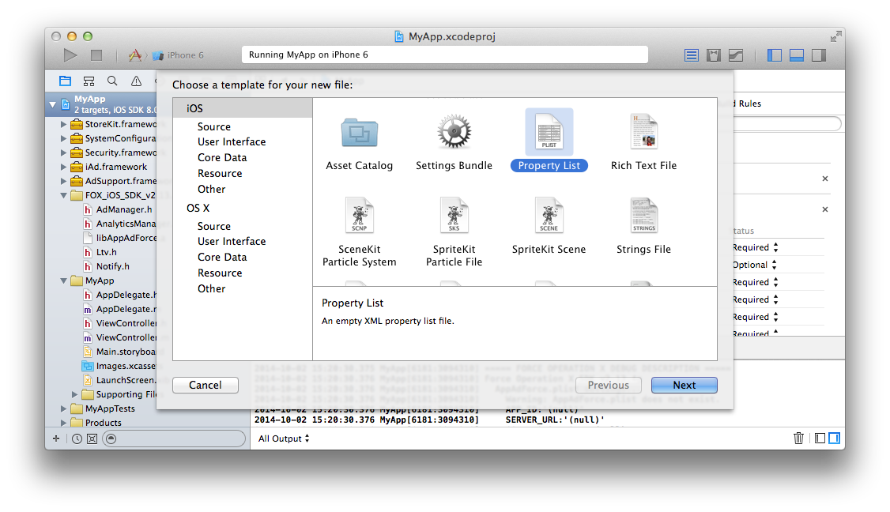
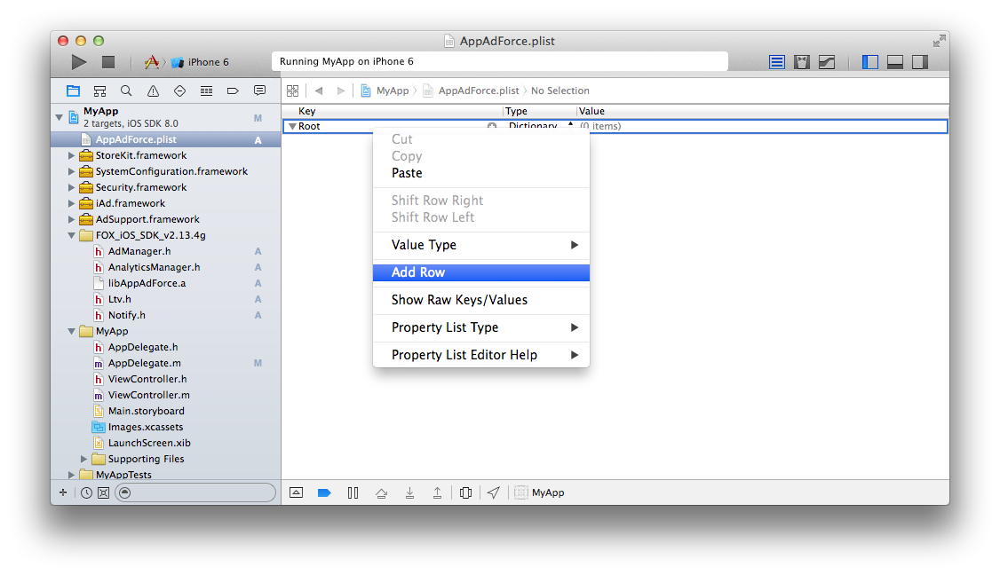

## SDK 설정을 위한 자세한 설명

SDK의 동작에 필요한 설정을 plist에 추가합니다. 「AppAdForce.plist」 라는 이름의 프로퍼티 리스트 파일을 프로젝트의 임의의 위치에 생성하고 아래의 키와 값을 입력하십시오.

임의의 장소에 오른쪽 클릭 → 「New File...」을 선택

「Property List」을 선택.

「AppAdForce.plist」 라는 이름으로 변경하고 「Create」 버튼을 클릭.

작성한 프로퍼티 리스트 파일을 선택. 마우스 오른쪽 클릭으로 메뉴를 열어, 「Add Row」를 선택

각각의 키와 값을 설정.

설정할 키와 값은 아래와 같습니다.

<table>
<tr>
  <th>Key</th>
  <th>Type</th>
  <th>Value</th>
</tr>
<tr>
  <td>APP_ID</td>
  <td>String</td>
  <td>Force Operation X 관리자로부터 받은 SDK 도입 안내 메일의 값을 입력해 주십시오.</td>
</tr>
<tr>
  <td>SERVER_URL</td>
  <td>String</td>
  <td>Force Operation X 관리자로부터 받은 SDK 도입 안내 메일의 값을 입력해 주십시오.</td>
</tr>
<tr>
  <td>APP_SALT</td>
  <td>String</td>
  <td>Force Operation X 관리자로부터 받은 SDK 도입 안내 메일의 값을 입력해 주십시오.</td>
</tr>
<tr>
  <td>APP_OPTIONS</td>
  <td>String</td>
  <td>아무것도 입력하지 않습니다.(공백 상태)</td>
</tr>
<tr>
  <td>CONVERSION_MODE</td>
  <td>String</td>
  <td>1</td>
</tr>
<tr>
  <td>ANALYTICS_APP_KEY</td>
  <td>String</td>
  <td>Force Operation X 관리자로부터 받은 SDK 도입 안내 메일의 값을 입력해 주십시오. 액세스 분석을 이용하지 않는 경우는 설정할 필요가 없습니다.</td>
</tr>
</table>

[AppAdForce.plist 샘플](./config_plist/AppAdForce.plist)

[TOP](/lang/ko/README.md)
