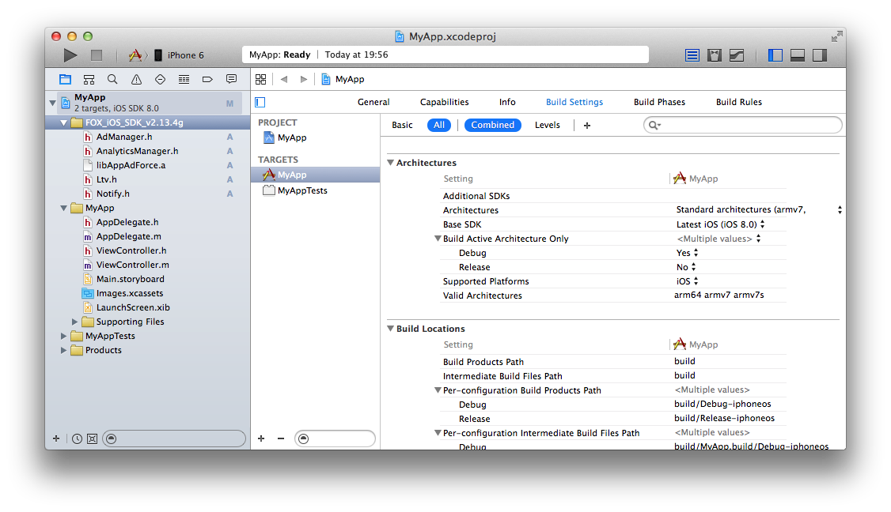

## 라이브러리를 추가를 위한 자세한 설명

다운로드 한 SDK 「FOX_iOS_SDK_.zip」의 압축을 해제하고, 아래 파일을 Xcode의 원하는 위치에 복사하여 앱의 프로젝트에 추가해 주십시오.

각 파일에 대한 설명은 다음과 같습니다.

<table>
<tr><th>기능명</th><th>필수</th><th>파일명</th></tr>
<tr><td>라이브러리 본체</td><td>필수</td><td>libAppAdForce.a</td></tr>
<tr><td>설치 측정</td><td>필수</td><td>AdManager.h</td></tr>
<tr><td>LTV 측정</td><td>옵션</td><td>Ltv.h</td></tr>
<tr><td>액세스 측정</td><td>옵션</td><td>AnalyticsManager.h</td></tr>
</table>

[TOP](/lang/ko/README.md)
